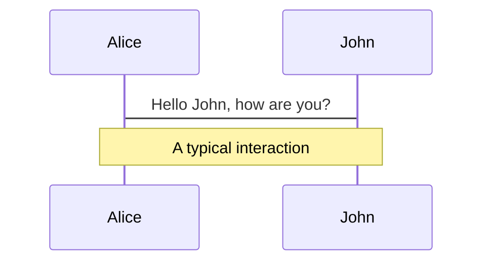

# Beispiele

<Toc mode="onlyCurrentTree" />

---

## Listen

- Foo
- Bar

* Bla
  - Blubb

1. item one
2. item two

---

## Layouts

- cover
- default
- image
- hands-on
- two-columns
- two-columns-header
- none

---
layout: cover
hideInToc: true
---

# Here goes the title

```md
---
layout: cover
---

# Here goes the title
```

---
layout: default
hideInToc: true
---

## a slide with content

---
layout: image
image: /assets/images/TCC-Bogen_r.png
layoutClass: "bg-sky-300"
hideInToc: true
---

- image
  - can be a local or remote resource uri
  - will be placed as a background image
- layoutClass will be applied to slide container

---

## Styling

- Theme uses UnoCSS with Tailwind 4 Flavor

<div class="bg-slate-300 p-3">Styled div</div>

```html
<div class="bg-slate-300 p-3">Styled div</div>
```

---

## Code-Beispiele

```ts twoslash
// TwoSlash enables TypeScript hover information
// and errors in markdown code blocks
// More at https://shiki.style/packages/twoslash
import { computed, ref } from "vue";

const count = ref(0);
const doubled = computed(() => count.value * 2);

doubled.value = 2;
```

---

### Line Numbers

- enable via `{all}`

```ts {all}
console.log("hello world!");
```

- stepping through with right arrow

```ts {all|1|2|3|all}
["1", "2", "3"].map((x) => +x).filter(isOdd);
```

---

### File Names

```ts [foo.ts]
console.log("arrr");
console.log("arrr");
console.log("arrr");
```

---

### Code Groups

::code-group

```ts [foo.component.ts]
export class MyErrorStateMatcher implements ErrorStateMatcher {
  isErrorState(
    control: FormControl | null,
    form: FormGroupDirective | NgForm | null,
  ): boolean {
    const isSubmitted = form && form.submitted;
    return !!(
      control &&
      control.invalid &&
      (control.dirty || control.touched || isSubmitted)
    );
  }
}

/** @title Input with a custom ErrorStateMatcher */
@Component({
  selector: "input-error-state-matcher-example",
  templateUrl: "./input-error-state-matcher-example.html",
  styleUrl: "./input-error-state-matcher-example.css",
  imports: [
    FormsModule,
    MatFormFieldModule,
    MatInputModule,
    ReactiveFormsModule,
  ],
})
export class InputErrorStateMatcherExample {
  emailFormControl = new FormControl("", [
    Validators.required,
    Validators.email,
  ]);

  matcher = new MyErrorStateMatcher();
}
```

```angular-html [foo.component.html]
<form class="example-form">
  <mat-form-field class="example-full-width">
    <mat-label>Email</mat-label>
    <input
      type="email"
      matInput
      [formControl]="emailFormControl"
      [errorStateMatcher]="matcher"
      placeholder="Ex. pat@example.com"
    />
    <mat-hint>Errors appear instantly!</mat-hint>
    @if (
      emailFormControl.hasError("email") &&
      !emailFormControl.hasError("required")
    ) {
      <mat-error>Please enter a valid email address</mat-error>
    }
    @if (emailFormControl.hasError("required")) {
      <mat-error>Email is <strong>required</strong></mat-error>
    }
  </mat-form-field>
</form>
```

```css [foo.component.css]
.example-form {
  min-width: 150px;
  max-width: 500px;
  width: 100%;
}

.example-full-width {
  width: 100%;
}
```

::

---

- Magic move

````md magic-move
```ts
const arr = ["1", "2", "3"].map((x) => +x);
```

```ts
const arr = ["1", "2", "3"]
  .map((x) => +x)
  .filter((x) => x % 2 != 0)
  .map((x) => x * 2);
```

```ts
const arr = ["1", "2", "3"]
  .map((x) => +x)
  .map((x) => x * 2)
  .filter((x) => x % 2 != 0);
```
````

---

```ts {monaco-run} {autorun:false}
const arr = ["1", "2", "3"]
  .map((x) => +x)
  .filter((x) => x % 2 != 0)
  .map((x) => x * 2);
console.log(arr);
```

---

- mermaid diagrams


